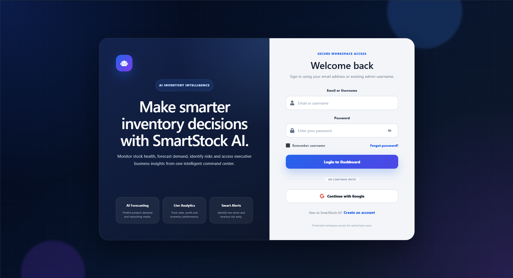
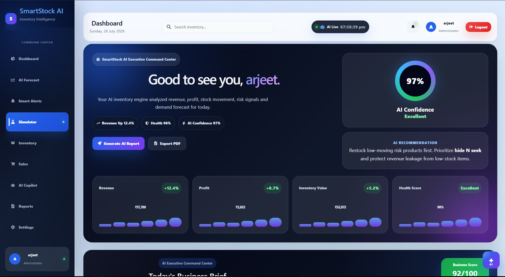
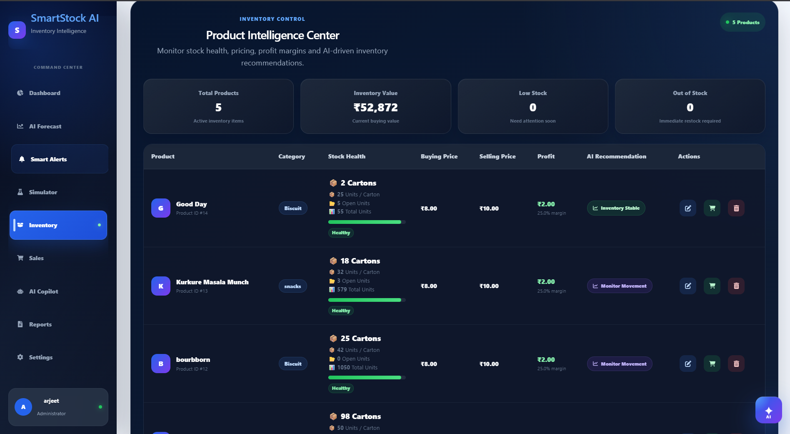
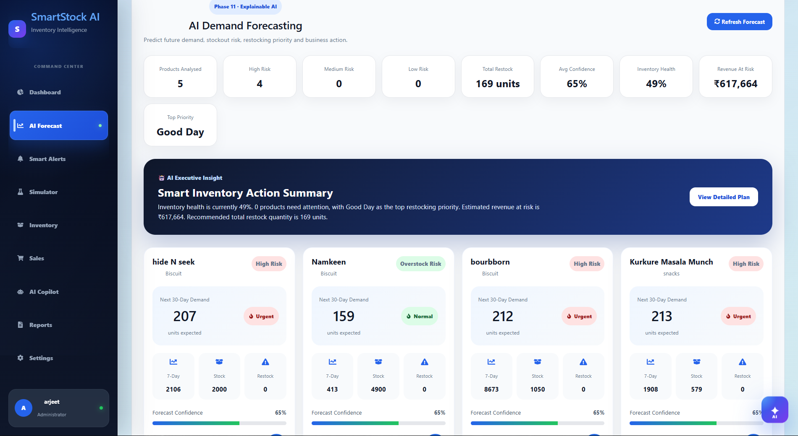
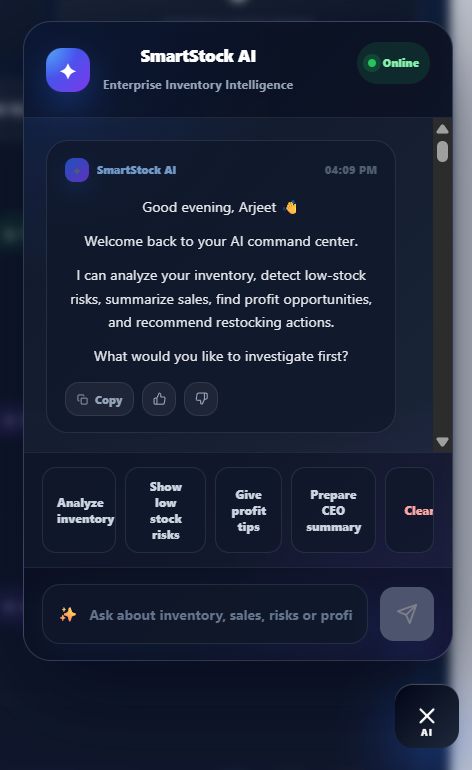
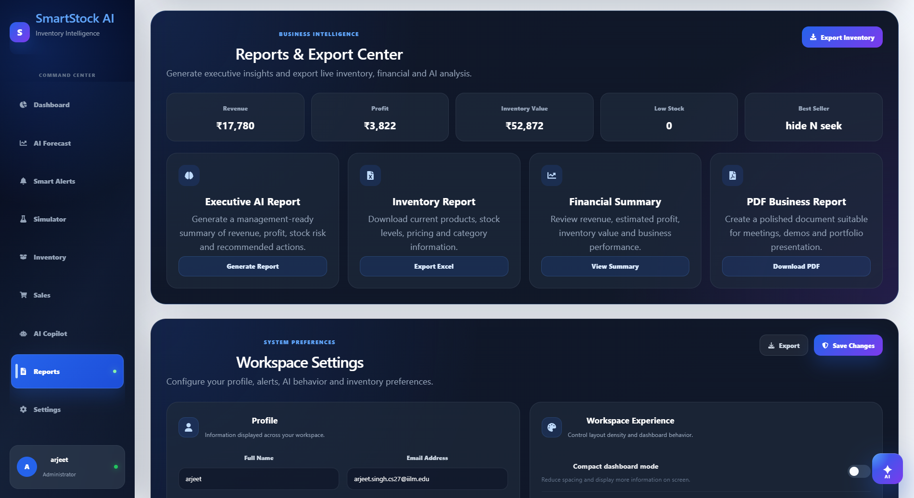

# 🚀 SmartStock AI – Inventory Intelligence Platform

SmartStock AI is a production-ready AI-powered Inventory Intelligence Platform that helps businesses monitor inventory, forecast future demand using Machine Learning, analyze sales, generate executive business reports, and receive AI-powered inventory recommendations.

The platform combines Machine Learning, Artificial Intelligence, Business Analytics, and Modern Web Technologies to provide an intelligent inventory management experience.

---

# ✨ Key Features

- 🔐 Secure Authentication System
  - User Registration
  - Login
  - JWT Authentication
  - Remember Me
  - Forgot Password
  - Password Reset

- 📦 Smart Inventory Management
  - Add Products
  - Update Products
  - Delete Products
  - Search & Filter
  - Category Management

- 📊 Interactive Dashboard
  - Revenue Analytics
  - Profit Analytics
  - Inventory Value
  - Low Stock Monitoring
  - Business KPIs

- 🤖 AI Demand Forecasting
  - Machine Learning Prediction
  - Random Forest Regressor
  - Future Stock Demand
  - Restock Recommendations

- 📈 Sales Analytics
  - Sales History
  - Profit Tracking
  - Best Selling Products
  - Inventory Performance

- 🧠 AI Inventory Copilot
  - AI Assistant
  - Business Suggestions
  - Inventory Insights
  - Executive Recommendations

- 📄 AI Executive Reports
  - PDF Report Generation
  - Business Summary
  - Risk Analysis
  - Growth Opportunities

- 📦 Carton Management
  - Unit & Carton Selling
  - Automatic Unit Conversion
  - Stock Validation

- 🌐 Fully Responsive UI

- ☁️ Cloud Deployment
  - Frontend → Vercel
  - Backend → Render
  - ML Service → Render

  ## 🌐 Live Demo

| Service | Link |
|---------|------|
| 🎨 Frontend | https://smart-stock-ai-ochre.vercel.app |
| ⚙️ Backend API | https://smartstock-ai-api.onrender.com |
| 🤖 ML Service | https://smartstock-ai-c9jl.onrender.com |

## 🛠️ Tech Stack

### Frontend
- React.js (Vite)
- JavaScript (ES6+)
- CSS3
- React Icons
- Chart.js
- Framer Motion

### Backend
- Node.js
- Express.js
- JWT Authentication
- bcrypt.js
- Resend Email API

### Database
- MySQL

### Machine Learning
- Python
- Flask
- Scikit-learn
- Pandas
- NumPy
- Random Forest Regressor

### Deployment
- Vercel (Frontend)
- Render (Backend)
- Render (ML Service)

### Development Tools
- VS Code
- Git
- GitHub
- Postman

## 🏗️ System Architecture

```text
                 User
                   │
                   ▼
      React + Vite Frontend (Vercel)
                   │
          REST API Requests
                   │
                   ▼
      Node.js + Express Backend
                   │
        ┌──────────┴──────────┐
        ▼                     ▼
     MySQL Database      Flask ML Service
                                │
                                ▼
                    Demand Forecast Model
                    (Random Forest)
```
## 📸 Application Screenshots






